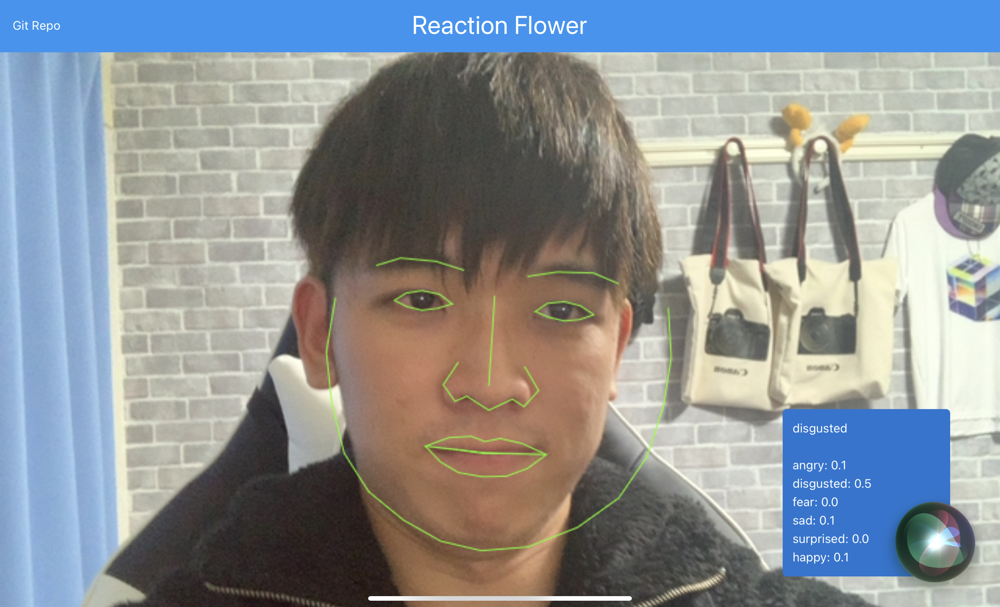

# [reaction flower](https://reaction-flower.herokuapp.com/)

This application can detect your emotions through your facial expression. There are six emotions that can be detected and the emotions are angry, disgusted, fear, sad, surprised and happy. When the application detects either surprised or happy from your expression, the object will move.


---

## Sample



## How to run

```
$ npm i
```

### test (nodemon & broswer up)

```
$ npm run test
```

### serve

```
$ npm run start
```

### nodemon

```
$ npm run nodemon
```

### open browser

```
$ npm run broswer
```

## LICENSE

Under [MIT License](./LICENSE.md) .
